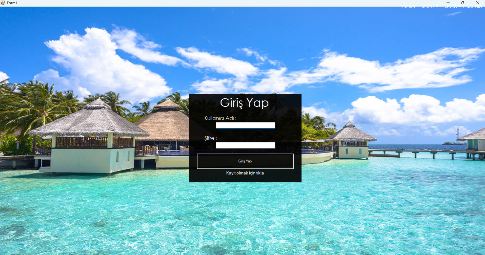
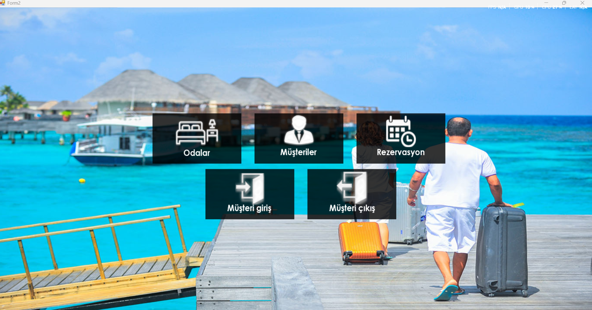
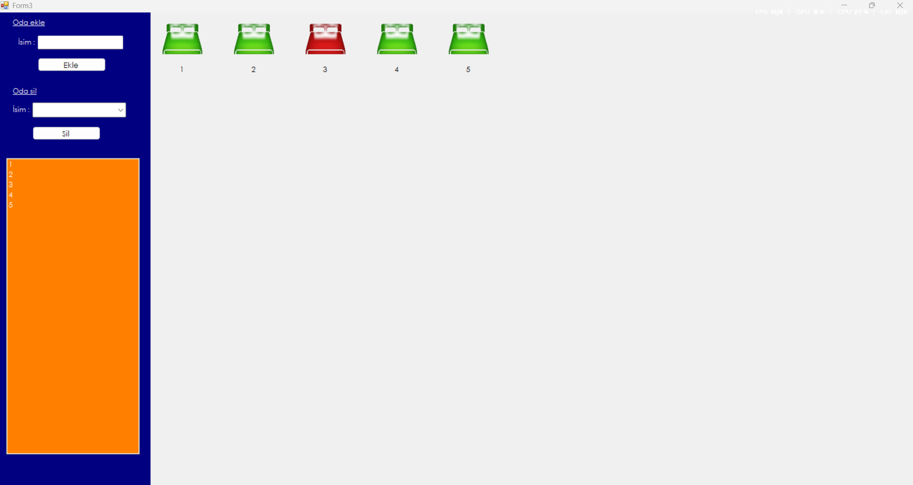
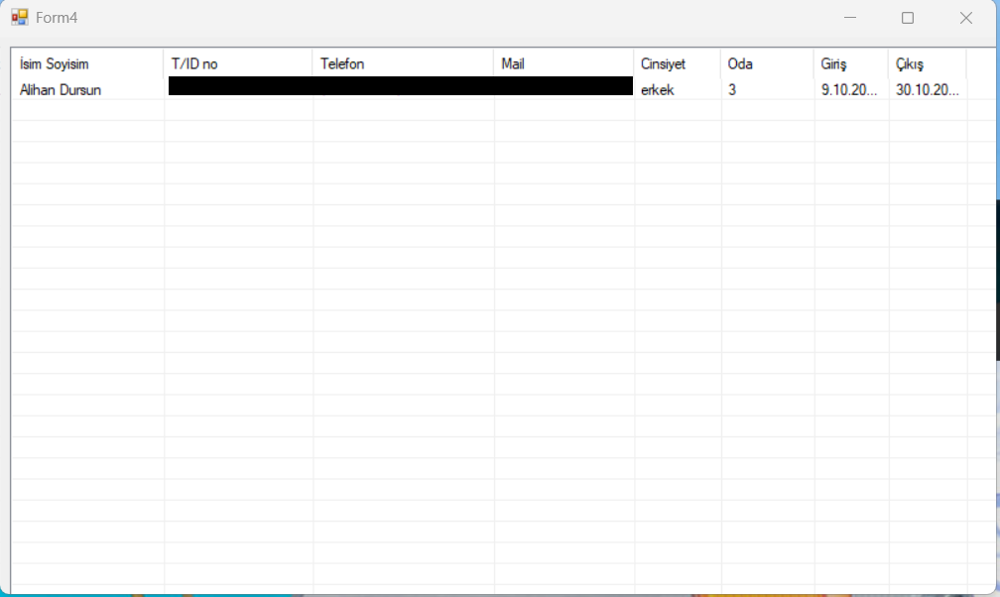
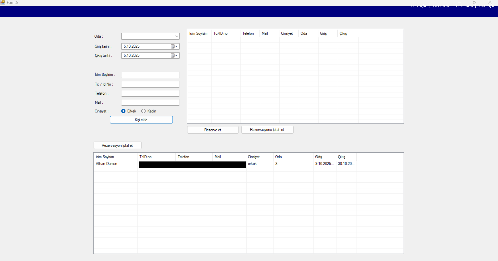
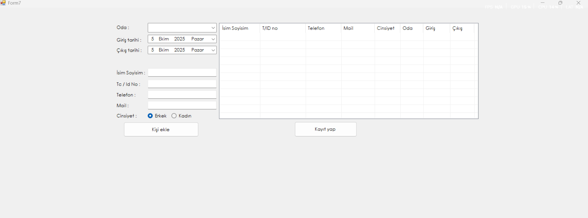
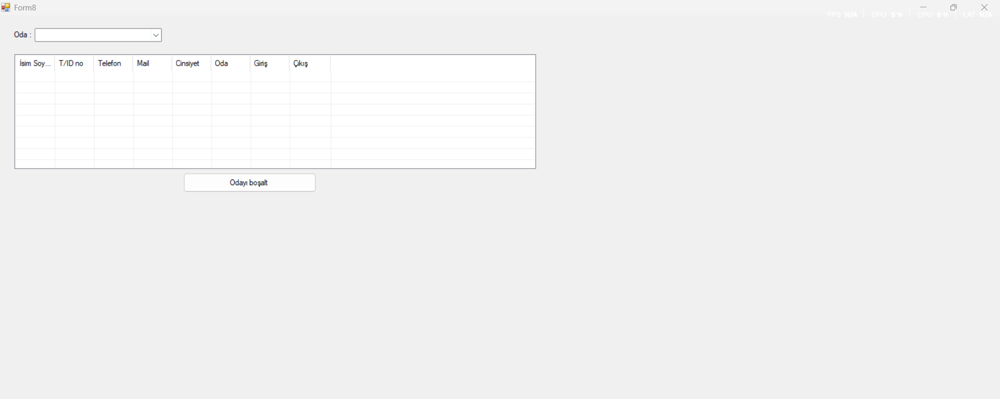

# 🏨 Otel Otomasyon Sistemi (Hotel Management System)

C# ve Windows Forms teknolojileri kullanılarak geliştirilmiş, otelcilik süreçlerini dijitalleştiren ve yönetim kolaylığı sağlayan kapsamlı bir masaüstü uygulamasıdır.

## 📋 Proje Hakkında

Bu proje, bir otelin resepsiyon, rezervasyon, oda yönetimi ve müşteri takibi gibi temel operasyonlarını tek bir merkezden yönetmek amacıyla tasarlanmıştır. 9 farklı form üzerinden yönetilen bu sistem, manuel kayıt tutma hatalarını en aza indirir ve işletme verimliliğini artırır.

### 🚀 Temel Özellikler

Proje modüler bir yapıda olup aşağıdaki işlemleri kapsamaktadır:

* **Güvenli Giriş:** Personel yetkilendirme ve giriş paneli.
* **Müşteri Yönetimi:** Yeni müşteri kaydı, bilgilerin güncellenmesi ve geçmiş müşteri sorgulama.
* **Oda Durum Takibi:** Odaların anlık durumu (Boş, Dolu, Kirli, Rezerve).
* **Rezervasyon İşlemleri:** Giriş (Check-in) ve Çıkış (Check-out) tarihine göre rezervasyon oluşturma.
* **Konaklama ve Ücretlendirme:** Oda tipi ve gün sayısına göre otomatik fiyat hesaplama.
* **Raporlama:** Günlük doluluk oranları veya kasa takibi (Geliştirilmeye açık).
* **Veritabanı Kaydı:** Tüm verilerin SQL tabanlı veritabanında kalıcı olarak saklanması.

## 🛠️ Teknolojiler

* **Dil:** C#
* **Arayüz:** Windows Forms Application (WinForms)
* **Veritabanı:** Microsoft Access Database
* **Platform:** .NET Framework
* **Mimari:** Çoklu Form Yapısı (Multi-Form Architecture)

## 📂 Form Yapısı ve İşlevler

Uygulama, görevlerin ayrılması prensibine göre farklı pencerelerden oluşur:

* **Form1:** (Örn: Admin/Personel Giriş Ekranı)
* **Form2:** (Örn: Ana Kontrol Paneli / Dashboard)
* **Form3 - Form5:** Müşteri Kayıt ve Rezervasyon Ekranları
* **Form6 - Form9:** Oda Takibi, Ödeme Ekranları ve Raporlama

